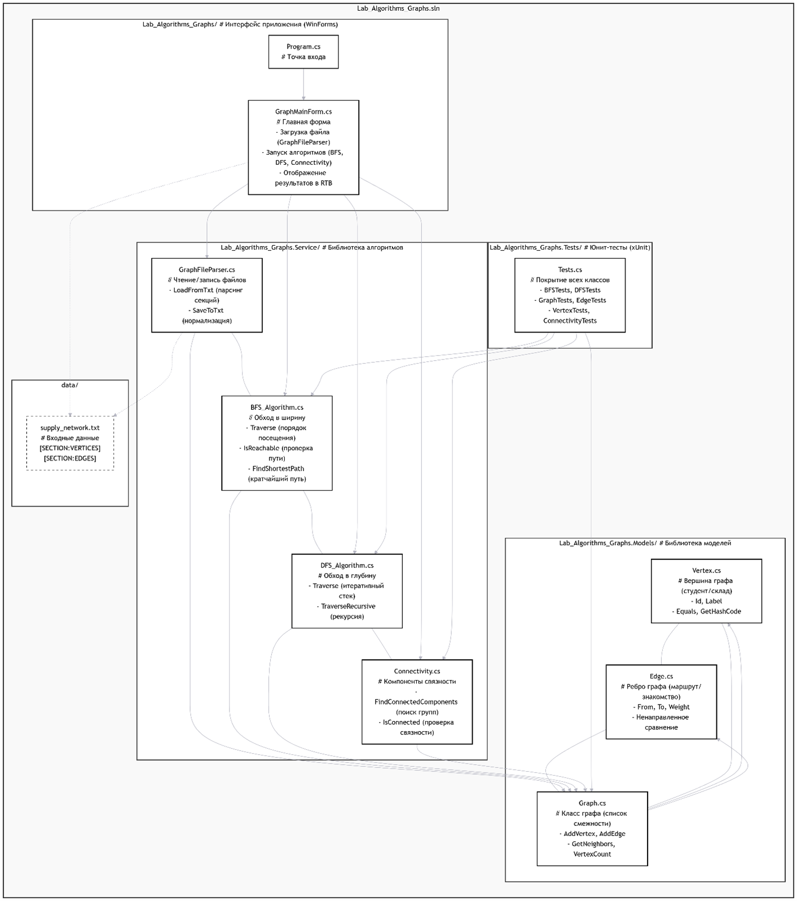

Вот обновленный вариант `README.md` с учетом всех твоих пожеланий. Текстовая структура заменена на картинку, добавлена подробная инструкция по запуску, а в технологиях указана актуальная для .NET 8 версия языка — **C# 12**.

---

# Сеть поставок товаров — Графовые алгоритмы

**Лабораторные работы №4–6 по дисциплине «Алгоритмизация и программирование»**  
**Вариант 10** | **Тверской государственный технический университет** | **2026**

---

## 📦 Описание проекта

Данный программный комплекс предназначен для моделирования и глубокого анализа **логистической сети поставок товаров**. Программа позволяет не только строить маршруты, но и находить критические точки инфраструктуры, оптимизировать стоимость дорожной сети и определять идеальные места для размещения распределительных центров.

| Элемент графа | Предметная область | Пример |
|---------------|-------------------|--------|
| **Вершины** | Склады, магазины, логистические хабы | `Склад_Север`, `Магазин_10` |
| **Рёбра** | Маршруты доставки между объектами | `Склад_А ↔ Магазин_1` |
| **Веса рёбер** | Стоимость доставки (тыс. руб.) | `15.0`, `25.5` |

---

## 🎯 Спецификация

| Параметр | Значение |
|----------|----------|
| **Предметная область** | Логистика и управление цепями поставок |
| **Вершины** | Склады и магазины (≥15) |
| **Рёбра** | Маршруты доставки (≥20) |
| **Вес ребра** | Стоимость или время доставки по маршруту |
| **Основная задача (ЛР6)**| **Поиск оптимального маршрута**: определение центрального хаба, минимизирующего суммарные затраты на доставку по всей сети. |

---

## 📁 Структура проекта



---

## 💻 Установка и запуск

**Требования:**
* [.NET 8.0 SDK](https://dotnet.microsoft.com/download)
* Visual Studio 2022 (рекомендуется для работы с WinForms-интерфейсом)

**Инструкция:**

1. Склонируйте репозиторий на свой компьютер:
   ```bash
   git clone https://github.com/IrishinT/Lab_Algorithms_Graphs.git
   ```
2. Перейдите в директорию проекта:
   ```bash
   cd Lab_Algorithms_Graphs
   ```
3. **Через Visual Studio (Рекомендуется):**
   * Откройте файл решения `.sln`.
   * Убедитесь, что проект `Lab_Algorithms_Graphs` (приложение WinForms) назначен как запускаемый проект по умолчанию.
   * Нажмите `F5` или кнопку **Пуск** на верхней панели.
4. **Через командную строку (.NET CLI):**
   ```bash
   dotnet run --project Lab_Algorithms_Graphs/Lab_Algorithms_Graphs.csproj
   ```

---

## 🚀 Реализованные алгоритмы

| Алгоритм | Назначение | Сложность |
|----------|------------|-----------|
| **BFS** | Поиск кратчайшего пути по количеству остановок | $O(V + E)$ |
| **DFS** | Исследование структуры и связности сети | $O(V + E)$ |
| **Dijkstra** | Поиск самого дешевого маршрута доставки (ЛР5) | $O(V^2)$ |
| **Prim's MST** | Оптимизация сети: минимальная стоимость связи всех узлов (ЛР6) | $O(V^2)$ |
| **Articulation Points**| Поиск критических складов (уязвимости сети) (ЛР6) | $O(V + E)$ |
| **Optimal Hub** | Поиск центральной точки для минимизации общих затрат (Вариант 10) | $O(V \cdot V^2)$ |

---

## 📝 Примеры использования

### 1. Алгоритм Дейкстры (Оптимальная цена)
1. Выберите склад «От» и магазин «До».
2. Нажмите **«Дейкстра»**.
3. **Результат в логе:** цепочка оптимального маршрута и итоговая стоимость.
4. **Результат в таблице:** автоматически заполняется матрица расстояний от выбранного склада до **всех** остальных объектов сети.

### 2. Анализ критических узлов
1. Нажмите **«Глубокий анализ»**.
2. Программа выделит склады, выход из строя которых приведет к изоляции части магазинов (точки сочленения).
   *   *Пример:* `Склад_Восток` является критическим.

### 3. Оптимизация инфраструктуры
1. В отчете появится список ребер **Минимального остовного дерева**.
2. Это «скелет» вашей сети: минимальный набор дорог, при котором все объекты остаются связанными, но затраты на содержание путей — минимальны.

### 4. Оптимальный маршрут
1. На основе суммарных весов всех путей программа определяет **Логистический Центр**.
   *   *Пример:* `Идеальная точка для хаба: Склад_Юг. Суммарная стоимость доставки: 145.20`.
2. Таблица `DataGridView` автоматически пересчитывается относительно этого центра.

---

## 🧪 Тестирование

Проект покрыт модульными тестами. Особое внимание уделено:
- Выбору Дейкстрой более длинного, но дешевого пути (в отличие от BFS).
- Корректному нахождению точек сочленения в графах типа «гантель».
- Обработке недостижимых вершин (вывод символа $\infty$).

```bash
# Запустить тесты из консоли
dotnet test Lab_Algorithms_Graphs.Tests
```

---

## 🛠 Технологии
- **Язык:** C# 12 / .NET 8.0
- **UI:** WinForms + SplitContainer + DataGridView
- **Тесты:** xUnit
- **IDE:** Visual Studio 2022